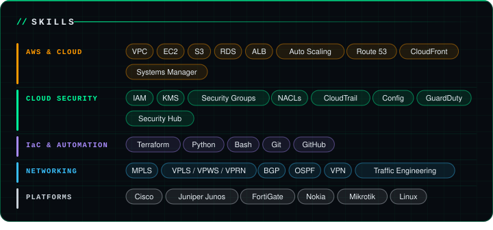
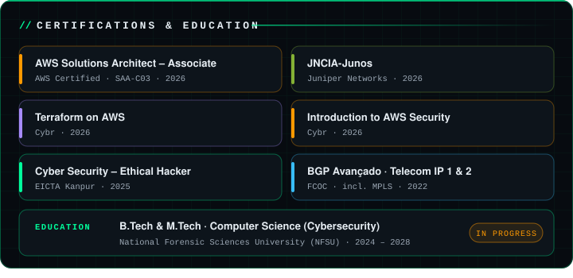
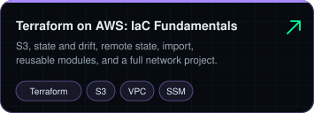
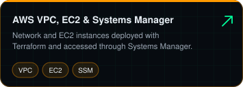
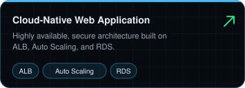
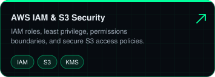

<table>
  <tr>
    <td width="210" valign="top" align="center">
      
    </td>
    <td valign="top">
      <b>Cloud Network Engineer</b> with 3+ years in enterprise and service provider networking, security, and infrastructure. On-prem depth (<b>Cisco, Juniper, FortiGate</b>) plus hands-on <b>AWS networking</b> (VPC, hybrid connectivity, multi-VPC) built as code with <b>Terraform</b>. Delivered large-scale <b>MPLS</b> projects for a major telecom operator in Angola. B.Tech in Cybersecurity in progress.
        
      
      
      
        
      
      
      
    </td>
  </tr>
</table>

Verify credentials:
<a href="https://www.credly.com/badges/05b20741-276e-448b-893b-18543a822216/public_url">AWS</a> ·
<a href="https://www.credly.com/earner/earned/badge/bd6e5b4a-aec5-4ed1-ab29-d85843d81ec8">Juniper</a> ·
<a href="https://verify.eicta.digitalcredentials.in/beab4ff9-547a-4d98-a915-959233801d70">EICTA</a>

  

 
<!-- TODO: replace the two links below with the real repositories -->

  

